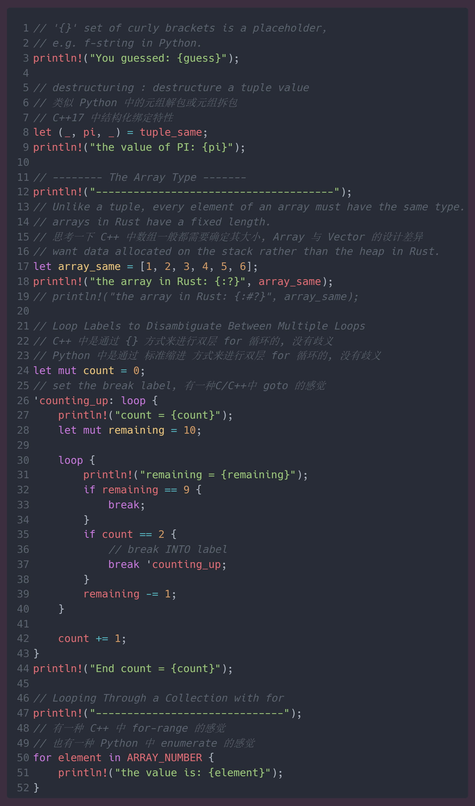

## the Rust Programming Language Learning

> Rust learning from scratch, 从零开始学习 Rust 编程语言. 学习 Rust 可以辅助我们对 C++ 有进一步深入的理解和编写更好的 C++ 代码. 应该学会阅读并利用好 Rust 编译器给出的错误提示、警告信息、以及建议(在Rust源代码中注意一下注释的代码, 可以打开注释, 然后编译看一看 Rust 给出的信息). 同时也可以思考现代编程语言的一下特性和设计理念(在Rust源代码中可以看到笔者的一些思考, 主要是相关 Python 和 C++, 笔者只熟练这两门 ^_^), 可以参考 Python, C++, Go, Ruby, Swift等.


<!-- 
```Rust
// '{}' set of curly brackets is a placeholder,
// e.g. f-string in Python.
println!("You guessed: {guess}");

// destructuring : destructure a tuple value
// 类似 Python 中的元组解包或元组拆包
// C++17 中结构化绑定特性
let (_, pi, _) = tuple_same;
println!("the value of PI: {pi}");

// -------- The Array Type -------
println!("--------------------------------------");
// Unlike a tuple, every element of an array must have the same type.
// arrays in Rust have a fixed length.
// 思考一下 C++ 中数组一般都需要确定其大小, Array 与 Vector 的设计差异
// want data allocated on the stack rather than the heap in Rust.
let array_same = [1, 2, 3, 4, 5, 6];
println!("the array in Rust: {:?}", array_same);
// println!("the array in Rust: {:#?}", array_same);

// Loop Labels to Disambiguate Between Multiple Loops
// C++ 中是通过 {} 方式来进行双层 for 循环的, 没有歧义
// Python 中是通过 标准缩进 方式来进行双层 for 循环的, 没有歧义
let mut count = 0;
// set the break label, 有一种C/C++中 goto 的感觉
'counting_up: loop {
    println!("count = {count}");
    let mut remaining = 10;

    loop {
        println!("remaining = {remaining}");
        if remaining == 9 {
            break;
        }
        if count == 2 {
            // break INTO label
            break 'counting_up;
        }
        remaining -= 1;
    }

    count += 1;
}
println!("End count = {count}");

// Looping Through a Collection with for
println!("------------------------------");
// 有一种 C++ 中 for-range 的感觉
// 也有一种 Python 中 enumerate 的感觉
for element in ARRAY_NUMBER {
    println!("the value is: {element}");
}
``` -->

**Overview**
- [feature](#features)
- [quick start](#quick-start)
- [simple example](#simple-example)
- [quick debugging](#quick-debugging)
- [project structure](#project-structure)
- [useful links](#useful-links)


### **Features**
- [x] Rust install & rustc compiler
- [x] rust-analyzer in VSCode extensions
- [x] Cargo is Rust building and package management
- [x] Rust build/compile/run/debugging/release
- [x] Core concepts: variables/basic types/functions/comments/control flow
- [x] Ownership(memory safety w/o garbage collector): borrowing/slices/memory data layout
- [ ] Struct to Structure Related Data
- [ ] Enums and Pattern Matching


### Quick start
```shell
# 1. Rust downloading and installing
rustc --version
# rustc 1.70.0 (90c541806 2023-05-31)

# Updating and Uninstalling
rustup update
rustup self uninstall

# Local Documentation
rustup doc

# 2. VSCode downloading and installing

# 3. rust-analyzer extension installing

# 4. simple hello_world example
mkdir hello_world && cd hello_world
touch main.rs

# compiler
rustc main.rs
./main

# 5. Rust with Cargo, which is Rust’s build system and package manager.
cargo --version
# cargo 1.70.0 (ec8a8a0ca 2023-04-25)

cargo new hello_cargo
# cargo new hello_cargo --vcs=git
cd hello_cargo
code .

cargo build
cargo run
cargo check

cargo build --release

# Rust source code format
rustfmt --version
# rustfmt 1.5.2-stable (90c54180 2023-05-31)
```

### Simple example
```Rust
// hello_cargo/src/main.rs
fn main(){
    println!("Hello, world.");
    println!("Hello, Rust world.\n");
    println!("Welcome the Rust programming world.\n");
}
```

### Quick debugging
- breakpoint in the 'main.rs' source code file via F9 in VSCode
- Ctrl + Shift + P, and enter >'rust-analyzer:Debug' via VSCode
- and then into the debugging mode!
- Rust 的debugging很有意思, 出了 main 的scope, 可以查看程序入口等一系列操作的过程!

### project structure

> 每一个文件夹都是一个被 cargo 管理的项目. Cargo nice!

```shell
# 进入文件夹
cd hello_cargo

# 通过 cargo 直接编译和运行程序
cargo run
```

```
. RustLanguageLearning
|—— hello_world
|   |—— main.rs
|—— hello_cargo
|   |—— Cargo.toml
|   |—— Cargo.lock
|   |—— src
|   |—— |—— main.rs
|   |—— target
|   |—— |—— debug
|   |—— |—— |—— hello_cargo.exe
|   |—— |—— |—— hello_cargo.pdb
|   |—— |—— release
|   |—— |—— |—— hello_cargo.exe
|   |—— |—— doc
|—— guessing_game
|   |—— Cargo.toml
|   |—— src
|   |—— |—— main.rs
|—— variables
|   |—— Cargo.toml
|   |—— src
|   |—— |—— main.rs
|—— data_type
|—— function_rust
|—— control_flow
|—— ownership_rust
|—— references_borrowing
|—— slice_type
|—— README.md
|—— LICENSE
|—— .gitignore
|—— images
```


### Useful links
- [Rust official site](https://www.rust-lang.org/)
- [Rust Download](https://www.rust-lang.org/)
- [The Rust Programming Language online](https://doc.rust-lang.org/book/)
- [Rust By Example online](https://doc.rust-lang.org/rust-by-example/)
- [Rust Language Cheat Sheet](https://cheats.rs/)
- [Rust crates registry](https://crates.io/)
